cd4\_explore
================
pattiey
25/01/2022

``` r
# load libraries
library(tidyverse)
```

    ## ── Attaching packages ─────────────────────────────────────── tidyverse 1.3.1 ──

    ## ✓ ggplot2 3.3.5     ✓ purrr   0.3.4
    ## ✓ tibble  3.1.6     ✓ dplyr   1.0.7
    ## ✓ tidyr   1.1.4     ✓ stringr 1.4.0
    ## ✓ readr   2.1.0     ✓ forcats 0.5.1

    ## ── Conflicts ────────────────────────────────────────── tidyverse_conflicts() ──
    ## x dplyr::filter() masks stats::filter()
    ## x dplyr::lag()    masks stats::lag()

``` r
library(Seurat)
```

    ## Registered S3 method overwritten by 'spatstat.geom':
    ##   method     from
    ##   print.boxx cli

    ## Attaching SeuratObject

``` r
library(ComplexHeatmap)
```

    ## Loading required package: grid

    ## ========================================
    ## ComplexHeatmap version 2.9.4
    ## Bioconductor page: http://bioconductor.org/packages/ComplexHeatmap/
    ## Github page: https://github.com/jokergoo/ComplexHeatmap
    ## Documentation: http://jokergoo.github.io/ComplexHeatmap-reference
    ## 
    ## If you use it in published research, please cite:
    ## Gu, Z. Complex heatmaps reveal patterns and correlations in multidimensional 
    ##   genomic data. Bioinformatics 2016.
    ## 
    ## The new InteractiveComplexHeatmap package can directly export static 
    ## complex heatmaps into an interactive Shiny app with zero effort. Have a try!
    ## 
    ## This message can be suppressed by:
    ##   suppressPackageStartupMessages(library(ComplexHeatmap))
    ## ========================================

We are interesting in the subtypes within CD4+ T cell populations. There
are known expression markers for each subtype

| Subtype | Expression Marker |
|---------|-------------------|
| Th1     | TBX21             |
| Th2     | GATA3, STAT5      |
| Th17    | ROR*γ*t (RORC)    |
| Th22    | BNC2, FOXO4, AHR  |
| Tfh     | BCL6              |
| Treg    | FOXP3             |

Create a list with expressiong markers

``` r
markers <- c("CD4", "CD8A", "IFNG", "TBX21", "GATA3", "STAT5A", "STAT5B", "RORC", "BNC2", "FOXO4", "AHR", "BCL6", "FOXP3")
```

# [GSE72056](https://www.ncbi.nlm.nih.gov/geo/query/acc.cgi?acc=GSE72056)

## Single cell RNA-seq analysis of melanoma

Found through this paper: [Metabolic landscape of the tumour
microenvironment at single cell
resolution](https://www.nature.com/articles/s41467-019-11738-0).

``` r
raw <- read.table("GSE72056_melanoma_single_cell_revised_v2.txt", sep = "\t", header = T)
columns <- raw[,1]
melanoma <- as.data.frame(t(raw[,-1]))
colnames(melanoma) <- columns
# There are duplicate columns for MARCH1 and MARCH2
# I'm not using them in this exploration so just remove them
melanoma <- melanoma %>% select(-MARCH1, -MARCH2)

# Filter for T cells cells
melanoma_Tcells <- melanoma %>% filter(`non-malignant cell type (1=T,2=B,3=Macro.4=Endo.,5=CAF;6=NK)` == 1)
melanoma_Tcells %>% select(markers) %>% summary()
```

    ## Note: Using an external vector in selections is ambiguous.
    ## ℹ Use `all_of(markers)` instead of `markers` to silence this message.
    ## ℹ See <https://tidyselect.r-lib.org/reference/faq-external-vector.html>.
    ## This message is displayed once per session.

    ##       CD4             CD8A            IFNG            TBX21       
    ##  Min.   :0.000   Min.   :0.000   Min.   : 0.000   Min.   :0.0000  
    ##  1st Qu.:0.000   1st Qu.:0.000   1st Qu.: 0.000   1st Qu.:0.0000  
    ##  Median :0.000   Median :5.113   Median : 0.000   Median :0.0000  
    ##  Mean   :1.535   Mean   :3.903   Mean   : 1.671   Mean   :0.2396  
    ##  3rd Qu.:3.437   3rd Qu.:7.533   3rd Qu.: 3.552   3rd Qu.:0.0000  
    ##  Max.   :8.562   Max.   :9.648   Max.   :11.274   Max.   :6.4920  
    ##      GATA3            STAT5A           STAT5B            RORC        
    ##  Min.   :0.0000   Min.   :0.0000   Min.   :0.0000   Min.   :0.00000  
    ##  1st Qu.:0.0000   1st Qu.:0.0000   1st Qu.:0.0000   1st Qu.:0.00000  
    ##  Median :0.0000   Median :0.0000   Median :0.0000   Median :0.00000  
    ##  Mean   :0.9488   Mean   :0.7704   Mean   :0.9108   Mean   :0.05322  
    ##  3rd Qu.:1.4014   3rd Qu.:0.0000   3rd Qu.:1.3533   3rd Qu.:0.00000  
    ##  Max.   :6.4096   Max.   :7.1190   Max.   :7.7280   Max.   :6.55210  
    ##       BNC2             FOXO4              AHR              BCL6      
    ##  Min.   :0.00000   Min.   :0.00000   Min.   :0.0000   Min.   :0.000  
    ##  1st Qu.:0.00000   1st Qu.:0.00000   1st Qu.:0.0000   1st Qu.:0.000  
    ##  Median :0.00000   Median :0.00000   Median :0.4730   Median :0.000  
    ##  Mean   :0.06202   Mean   :0.05025   Mean   :0.8207   Mean   :0.617  
    ##  3rd Qu.:0.00000   3rd Qu.:0.00000   3rd Qu.:1.0259   3rd Qu.:0.000  
    ##  Max.   :3.96250   Max.   :4.75140   Max.   :6.3413   Max.   :7.097  
    ##      FOXP3       
    ##  Min.   :0.0000  
    ##  1st Qu.:0.0000  
    ##  Median :0.0000  
    ##  Mean   :0.2754  
    ##  3rd Qu.:0.0000  
    ##  Max.   :7.4794

``` r
# Correlation Heatmap of expression markers
melanoma_Tcells %>% select(markers) %>% cor() %>% Heatmap(cluster_rows = FALSE, cluster_columns = FALSE)
```

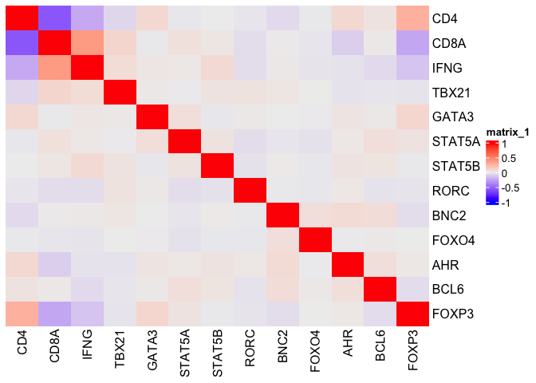<!-- -->

``` r
melanoma_Tcells %>% ggplot() + geom_point(aes(CD4, CD8A), alpha = 0.2)
```

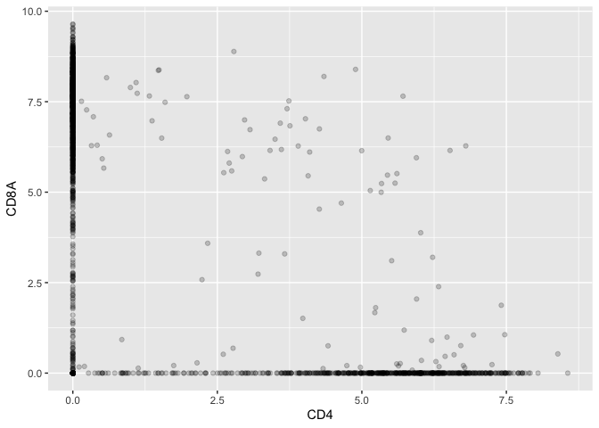<!-- -->

``` r
combined_density <- melanoma_Tcells %>% ggplot() + geom_density(aes(CD4), fill = "green", alpha = 0.2) + geom_density(aes(CD8A), fill = "blue", alpha = 0.2)
cd4_density <- melanoma_Tcells %>% filter(CD8A == 0) %>% ggplot() + geom_density(aes(CD4), fill = "green", alpha = 0.2)
cd8_density <- melanoma_Tcells %>% filter(CD4 == 0) %>% ggplot() + geom_density(aes(CD8A), fill = "blue", alpha = 0.2)
cd4_density + cd8_density + combined_density
```

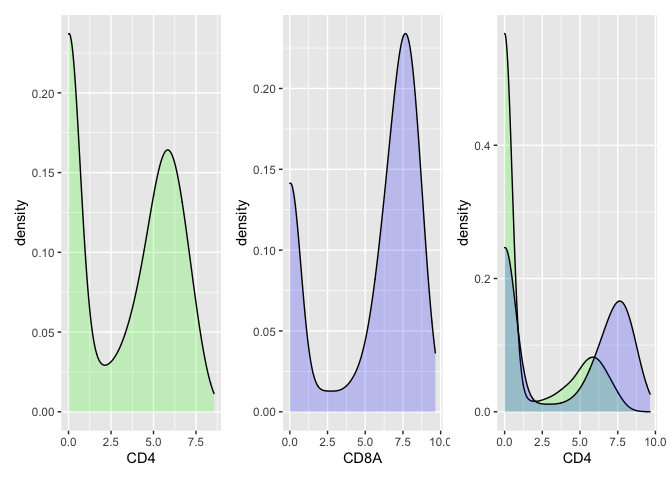<!-- -->

``` r
# Convert to a Seurat object
melanoma.Seurat <- CreateSeuratObject(counts = t(melanoma[,-c(1:3)]), project = "melanoma_T", min.cells = 3, min.features = 50)
```

    ## Warning: The following arguments are not used: row.names

    ## Warning: Feature names cannot have underscores ('_'), replacing with dashes
    ## ('-')

``` r
melanoma.Seurat[["Sample"]] <- rownames(melanoma)
colnames(melanoma_Tcells)[1:3]
```

    ## [1] "tumor"                                                       
    ## [2] "malignant(1=no,2=yes,0=unresolved)"                          
    ## [3] "non-malignant cell type (1=T,2=B,3=Macro.4=Endo.,5=CAF;6=NK)"

``` r
melanoma.Seurat[["Dataset"]] <- "melanoma"
melanoma.Seurat[["Tumour.Status"]] <- melanoma %>% select(tumor)
melanoma.Seurat[["Malignant"]] <- melanoma %>% select(`malignant(1=no,2=yes,0=unresolved)`)
melanoma.Seurat[["Cell.Type"]] <- melanoma %>% select(`non-malignant cell type (1=T,2=B,3=Macro.4=Endo.,5=CAF;6=NK)`)

melanoma.Seurat <- FindVariableFeatures(melanoma.Seurat)
melanoma.Seurat <- ScaleData(melanoma.Seurat)
```

    ## Centering and scaling data matrix

``` r
melanoma.Seurat <- RunPCA(melanoma.Seurat)
```

    ## PC_ 1 
    ## Positive:  SPARC, SERPINE2, S100B, GSN, GPNMB, S100A13, LMNA, CNN3, VAT1, LGALS3BP 
    ##     PRAME, TIMP1, PLP1, LGALS3, APOD, CST3, MFGE8, MIA, PMP22, LGALS1 
    ##     TYR, CD63, PTTG1IP, ST3GAL4, SRPX, TMEM98, CTSL1, IFITM3, SGK1, AP1S2 
    ## Negative:  PTPRC, TMSB4X, ARHGDIB, PTPRCAP, LAPTM5, CXCR4, CORO1A, RAC2, LCP1, CD52 
    ##     IL2RG, CCL5, B2M, CD53, CD37, CD3D, CD74, CD2, LSP1, IL32 
    ##     CYTIP, CD69, SRGN, LCK, HCLS1, ITGB2, CD48, SLA, TBC1D10C, ZAP70 
    ## PC_ 2 
    ## Positive:  CSF1R, CD14, CD163, TYROBP, PLXDC2, HCK, LILRB4, FCER1G, FCGR1A, IGSF6 
    ##     PILRA, CYBB, TMEM176B, IFI30, C1QC, VSIG4, AIF1, C1QA, S100A9, MSR1 
    ##     MS4A4A, MNDA, FPR1, SLCO2B1, C3AR1, FPR3, TMEM176A, LST1, NCF2, ALDH2 
    ## Negative:  CD3D, CD2, IL32, TYR, PMEL, ZAP70, PRAME, NSG1, CD8A, LDHB 
    ##     MIA, PLP1, SERPINE2, PRKCH, LCK, KLRK1, GPR143, GZMK, CAPN3, SLC24A5 
    ##     CCL5, TIGIT, GZMA, MFGE8, SIRPG, CST7, PYHIN1, CD8B, IL2RB, DNAJB1 
    ## PC_ 3 
    ## Positive:  NKG7, CST7, PRF1, CD8A, IL32, CCL4, SRGN, KLRK1, GZMA, CD2 
    ##     CTSW, IL2RB, TIGIT, CCL4L1, CCL4L2, ID2, GZMK, PRKCH, CD3D, CD8B 
    ##     PDCD1, ITM2A, CCL3, LAG3, IFITM1, HCST, GBP2, SIRPG, S100A4, GAPDH 
    ## Negative:  BANK1, MS4A1, CD79A, BCL11A, CD19, CD22, IGLL5, VPREB3, BLK, NAPSB 
    ##     CD79B, TCL1A, HLA-DOB, FCER2, BLNK, NCF1C, NCF1, CR2, STAP1, HVCN1 
    ##     IRF8, IGLL3P, CNR2, ADAM28, FCRL5, BTK, SNX29P1, FCRLA, NCF1B, FCRL2 
    ## PC_ 4 
    ## Positive:  BGN, THY1, EFEMP1, TFPI, COL4A1, COL3A1, PPIC, COL1A1, RARRES2, DCN 
    ##     C1S, FMOD, C1R, ELN, ISLR, LUM, GNG11, IL33, CDH5, MFAP4 
    ##     IGFBP4, ECSCR, MXRA8, MMP2, CXCR7, COL1A2, TNXB, PLAC9, CD34, RAMP2 
    ## Negative:  PMEL, TYR, SERPINA1, CAPN3, APOC2, APOE, NSG1, PRAME, ASAH1, BIRC7 
    ##     S100B, GPNMB, APOC1, SLC24A5, QPCT, AP1S2, GPR143, GPM6B, FXYD3, PIR 
    ##     MIA, SAT1, RPS4Y1, GDF15, SPP1, C1QB, PLP1, CSF1R, SLC45A2, ST3GAL4 
    ## PC_ 5 
    ## Positive:  TYMS, TK1, FCRLA, CD79A, UBE2C, PKMYT1, MS4A1, UBE2T, ASF1B, AURKB 
    ##     CD19, CD79B, CCNB2, CDK1, BANK1, ZWINT, MAD2L1, CD22, BCL11A, CDC20 
    ##     IRF8, IGLL5, HLA-DPA1, CDKN3, NAPSB, HLA-DOB, GINS2, VPREB3, CENPM, CCNB1 
    ## Negative:  SERPINA1, TRIML2, APOC2, A2M, SEPP1, ANXA1, RDH5, SPP1, B2M, MPZ 
    ##     C1QB, CD163, CD14, APOE, APOC1, GATSL3, IL7R, EGR1, MSR1, CSF1R 
    ##     FCGR1A, SERPINA3, S100A9, TIMP1, PILRA, TM4SF1, FOS, CST3, MS4A4A, VSIG4

``` r
pca_plot <- DimPlot(melanoma.Seurat, group.by = c("Malignant", "Cell.Type"), reduction = "pca") 
pca_plot[[1]]$layers[[1]]$aes_params$alpha <- 0.2
pca_plot[[2]]$layers[[1]]$aes_params$alpha <- 0.2
pca_plot 
```

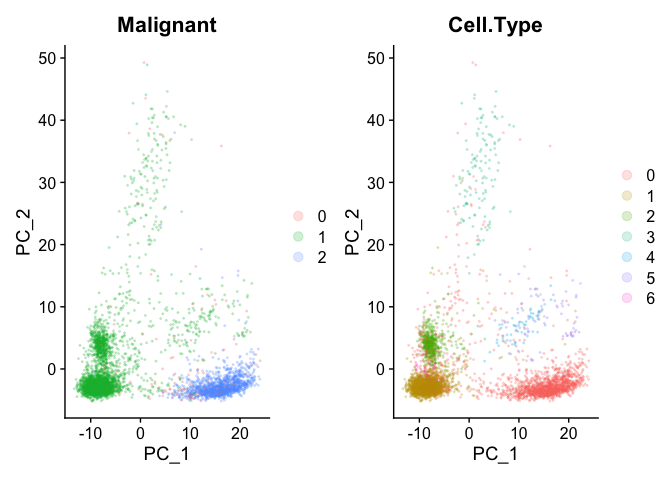<!-- -->

### T cells

``` r
Idents(melanoma.Seurat) <- "Cell.Type"
melanoma.Tcells <- subset(melanoma.Seurat, idents = 1)
melanoma.Tcells <- FindVariableFeatures(melanoma.Tcells)
melanoma.Tcells <- ScaleData(melanoma.Tcells)
```

    ## Centering and scaling data matrix

``` r
melanoma.Tcells <- RunPCA(melanoma.Tcells)
```

    ## PC_ 1 
    ## Positive:  IL7R, TXNIP, CCR7, JUNB, CXCR4, GPR183, TSC22D3, FOS, SELL, LDLRAP1 
    ##     PIK3IP1, DUSP1, ZBTB16, LTB, TNFSF8, CD40LG, SLC40A1, AREG, RPL21, DHRS3 
    ##     AQP3, CD69, ANXA1, C1orf162, SCARNA17, MAL, RPS5, TOB1, SNORD22, RPL21P28 
    ## Negative:  FABP5, TYMS, HLA-DRB1, TPI1, PGAM1, CD74, ZWINT, HLA-DRA, HLA-DPA1, CLIC1 
    ##     ANXA5, LSP1, FKBP1A, TK1, PARK7, COTL1, ASF1B, TUBB, HLA-DMA, WARS 
    ##     APOBEC3C, APOBEC3G, PSME2, TIGIT, PSMB9, UBB, PRF1, PCNA, ATP5B, ENO1 
    ## PC_ 2 
    ## Positive:  IL7R, CD4, SELL, LTB, CCR7, GPR183, CD40LG, RPS5, LDHB, EEF1B2 
    ##     AQP3, GAS5, RPL13A, TNFRSF25, MAL, NOSIP, NFKBIA, TIMP1, JUNB, FXYD5 
    ##     EIF3E, ICAM2, CCR4, VIM, LDLRAP1, SNHG8, ZBTB16, SNHG1, ANXA1, TNFSF8 
    ## Negative:  NKG7, CD8A, KLRK1, CCL4, CST7, PRF1, CCL4L2, CCL4L1, CD8B, GZMA 
    ##     GZMK, CCL3, CTSW, CCL3L3, HLA-DRB1, IFNG, HLA-DPA1, FCRL3, HSPA1A, KLRC4 
    ##     VCAM1, HSPA1B, CD74, ID2, GZMH, KLRC3, GZMB, RGS2, PDCD1, SNAP47 
    ## PC_ 3 
    ## Positive:  NMB, FCRL3, RGS4, HSPA1B, CD200, HSPA1A, TSC22D1, RGS2, XCL2, WARS 
    ##     PMEL, EPYC, MAOB, HSPA6, DNAJB1, NUCB2, TYRP1, FABP5, HSP90AB1, SH2D1B 
    ##     TIGIT, C11orf75, ITM2A, GNG11, CD27, HIST1H2BG, CXCL13, EIF3L, CDO1, LY9 
    ## Negative:  GZMH, S100A6, GZMA, VIM, GNLY, ANXA1, S100A4, C12orf75, CD52, GZMB 
    ##     SAMD3, CCR5, CRIP1, ANXA2, APOBEC3G, IFI6, CORO1A, LGALS1, S100A11, ALOX5AP 
    ##     SELPLG, GLIPR2, OASL, ADRB2, APOBEC3C, FGFBP2, S100A10, ADAM8, GBP1, CARD16 
    ## PC_ 4 
    ## Positive:  TYMS, TK1, ASF1B, CDK1, ZWINT, HIST1H3G, UBE2C, GINS2, PCNA, CKS1B 
    ##     MAD2L1, CDKN3, RPS26, MIR155HG, CENPM, CDC20, MCM7, TMEM106C, DNAJC9, RNASEH2A 
    ##     CCNB1, PTTG1, TEX30, SNRPG, RANBP1, CCR8, NUDT1, MCM3, KNSTRN, MCM5 
    ## Negative:  CD69, GIMAP5, TXNIP, AOAH, LY9, CD48, GIMAP4, IFITM1, GIMAP7, PTPRCAP 
    ##     ZFP36, FOS, BIN2, BTG2, CD53, PVRIG, SELPLG, GZMM, IER2, UBC 
    ##     RAC2, JUNB, SIGIRR, DNAJB1, FCRL6, PIM1, ANXA1, IL7R, FGR, CORO1A 
    ## PC_ 5 
    ## Positive:  CDK1, TYMS, UBE2C, ASF1B, ZWINT, TK1, HIST1H3G, MCM7, CDC20, CDKN3 
    ##     CCNB1, ANXA1, PHGDH, TUBA1B, AOAH, CKS1B, KLRK1, CTSW, GINS2, TUBB4B 
    ##     PCNA, KIF22, PMEL, RNASEH2A, ITM2C, GZMH, TUBB, CD8A, HIST1H4C, GIMAP7 
    ## Negative:  TNFRSF18, TNFRSF4, CTLA4, TIGIT, CD4, ICOS, CCR8, BATF, LAIR2, CD27 
    ##     MAGEH1, IL21, PDCD1, RGS1, SLA, ITM2A, NINJ2, SIRPG, LOC541471, IL1R2 
    ##     SOD1, CD177, BHLHE40-AS1, IGFLR1, CD200, GLRX, PRNP, PIM2, CARD16, ETV7

``` r
FeaturePlot(melanoma.Tcells, features = markers, reduction = 'pca')
```

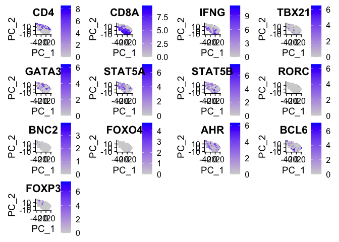<!-- -->

``` r
FeaturePlot(melanoma.Tcells, features = c("CD4", "CD8A"), reduction = 'pca')
```

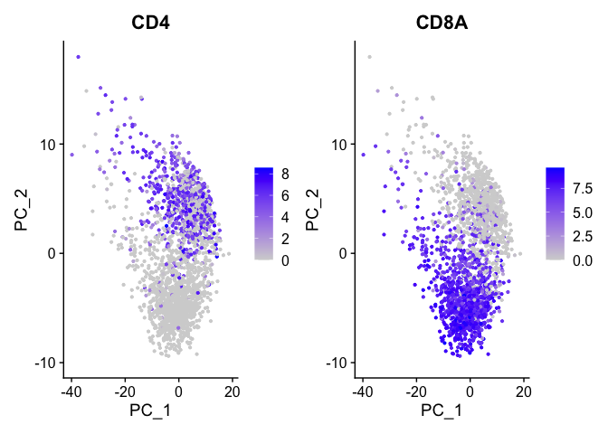<!-- -->

### CD4+ T cells

``` r
melanoma.cd4 <- subset(melanoma.Tcells, subset = CD4 > 0)
melanoma.cd4 <- FindVariableFeatures(melanoma.cd4)
melanoma.cd4 <- ScaleData(melanoma.cd4)
```

    ## Centering and scaling data matrix

``` r
melanoma.cd4 <- RunPCA(melanoma.cd4)
```

    ## PC_ 1 
    ## Positive:  IL7R, TXNIP, CCR7, TSC22D3, FOS, LDLRAP1, JUNB, CXCR4, PIK3IP1, JUN 
    ##     CD69, RPL13AP5, GPR183, ZBTB16, MBOAT4, SNORD26, SLC40A1, OR1N2, TMEM71, SELL 
    ##     DUSP1, SNORD32A, SPIC, RPL21, TMEM81, OR5AK4P, GLTSCR2, NUP62CL, ATP6V1G2, CD40LG 
    ## Negative:  GAPDH, FABP5, TYMS, PGAM1, TPI1, HLA-DMA, APOBEC3C, FKBP1A, WARS, ANXA5 
    ##     CLIC1, COX5A, HLA-DRB1, CD74, HLA-DRA, H2AFZ, NME1, ASF1B, ARPC1B, HLA-DPA1 
    ##     PPP1CA, PTTG1, COX8A, APOBEC3G, TK1, ATP5B, AP2M1, GNG5, KPNA2, PSMA2 
    ## PC_ 2 
    ## Positive:  ICA1, CTLA4, TIGIT, TNFRSF18, LOC541471, MAGEH1, TNFRSF4, BATF, CCR8, NINJ2 
    ##     ICOS, CCDC167, SIRPG, PDCD1, CD2, LINC00152, ITM2A, IL32, CXCR6, C9orf16 
    ##     PTTG1, DNPH1, IL21, PSMB1, ETV7, CXCR5, LAIR2, SEC11C, PPP1CA, GAPDH 
    ## Negative:  TYROBP, ADM, FCER1G, ANXA1, FOS, S100A9, KLRK1, IFI30, IL7R, CST3 
    ##     SPP1, CD69, CTSW, CD8A, CXCR4, C1orf162, S100A8, CD14, C1QA, C1QB 
    ##     CCL2, FCGRT, IL1B, CTSH, CD8B, GZMB, CCR7, IL8, CXCL2, FCGR3A 
    ## PC_ 3 
    ## Positive:  CCR7, EEF1B2, SELL, EIF3E, LDHB, PIK3IP1, GAS5, IL7R, ICAM2, EIF3L 
    ##     RPL21, CD40LG, SLC25A6, COX7C, OXA1L, MAL, FOS, SYPL1, LDLRAP1, NFKBIA 
    ##     SNHG1, CCDC109B, ATIC, CD48, EIF3H, ETHE1, CCT2, BTF3, TXNIP, APEX1 
    ## Negative:  CCL4, NKG7, CST7, GZMA, CCL4L2, CCL4L1, PRF1, GZMH, GZMB, CCR5 
    ##     CCL3, CXCR6, CD8A, CCL3L3, KLRK1, APOBEC3G, LINC00152, CXCR3, CHST12, KLRC3 
    ##     HLA-DRB1, CD74, GZMK, CTSW, CD8B, FCGR3A, CLIC3, FASLG, ZBED2, IFNG 
    ## PC_ 4 
    ## Positive:  S100A4, VIM, S100A6, LTB, CCR8, LGALS1, TIMP1, AQP3, S100A11, IL32 
    ##     C3AR1, PLP2, ANXA2, CISH, ANXA1, TAGLN2, SELPLG, IL1R2, IL7R, S100A10 
    ##     PIM1, IFI6, LGALS3, CCR4, LMNA, SAMSN1, UGP2, CCR2, CD177, SLAMF1 
    ## Negative:  PDCD1, CHI3L2, NKG7, CD8A, CCL4L1, CCL4L2, CD8B, KLRK1, CCL4, CXCL13 
    ##     SH2D1A, ITM2A, FABP5, CCL3L3, CD200, CCL3, GZMK, ICA1, IFNG, C11orf75 
    ##     NMB, AP3S1, HSPA6, TIGIT, TARP, RGS4, RGS2, XCL2, VNN2, NUCB2 
    ## PC_ 5 
    ## Positive:  ANXA1, GZMA, CXCR4, CORO1A, CD69, CD52, PTPRCAP, IFITM1, ALOX5AP, CD48 
    ##     CCND3, VIM, GPR183, PTGER4, ADRB2, TSEN54, LIME1, TSC22D3, GZMK, JUNB 
    ##     CCL4, RAC2, CRIP1, CHST12, BIN2, DUSP2, GLIPR2, GSTK1, GMFG, C12orf75 
    ## Negative:  UBD, IGFBP7, IL33, APOE, TYROBP, TMEM176A, CST3, CLEC4G, CXCL2, S100A16 
    ##     SDPR, CLEC4M, DARC, ADM, CHI3L1, CCL14, CLDN5, RARRES2, TUBB6, C1QA 
    ##     PMEL, SPP1, S100A13, C1QB, IL1R2, CRYAB, ICA1, RAB20, CCR8, TGFB1I1

``` r
FeaturePlot(melanoma.cd4, features = markers, reduction = 'pca')
```

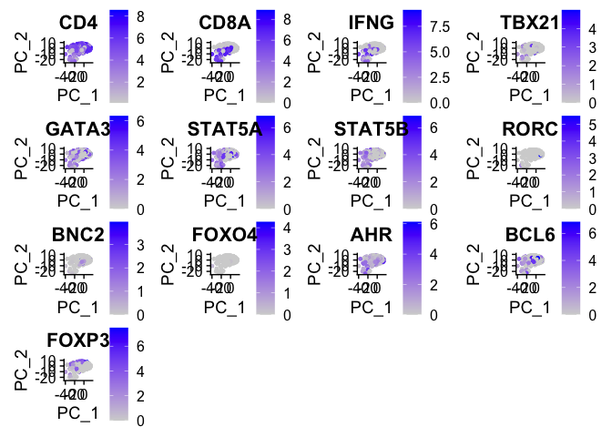<!-- -->

# [GSE103322](https://www.ncbi.nlm.nih.gov/geo/query/acc.cgi?acc=GSE103322)

``` r
raw <- read.table("GSE103322_HNSCC_all_data.txt", sep = "\t", header = T)
columns <- raw[,1]
HNSCC <- as.data.frame(t(raw[-(1:5),-1]))
colnames(HNSCC) <- columns[-(1:5)]
HNSCC <- HNSCC %>% mutate_all(function(x) as.numeric(as.character(x)))
metadata <- as.data.frame(t(raw[1:5, -1]))
colnames(metadata) <- columns[1:5]
HNSCC <- cbind(metadata, HNSCC)

# Filter for T cells cells
HNSCC_Tcells <- HNSCC %>% filter(`non-cancer cell type` == "T cell")
HNSCC_Tcells %>% select(markers) %>% summary()
```

    ##       CD4             CD8A            IFNG            TBX21       
    ##  Min.   :0.000   Min.   :0.000   Min.   : 0.000   Min.   :0.0000  
    ##  1st Qu.:0.000   1st Qu.:0.000   1st Qu.: 0.000   1st Qu.:0.0000  
    ##  Median :0.000   Median :0.000   Median : 0.000   Median :0.0000  
    ##  Mean   :1.341   Mean   :2.232   Mean   : 1.036   Mean   :0.1078  
    ##  3rd Qu.:0.000   3rd Qu.:6.178   3rd Qu.: 0.000   3rd Qu.:0.0000  
    ##  Max.   :8.627   Max.   :9.050   Max.   :10.726   Max.   :7.2402  
    ##      GATA3            STAT5A           STAT5B            RORC        
    ##  Min.   :0.0000   Min.   :0.0000   Min.   :0.0000   Min.   :0.00000  
    ##  1st Qu.:0.0000   1st Qu.:0.0000   1st Qu.:0.0000   1st Qu.:0.00000  
    ##  Median :0.0000   Median :0.0000   Median :0.0000   Median :0.00000  
    ##  Mean   :1.1595   Mean   :0.6223   Mean   :0.6429   Mean   :0.03528  
    ##  3rd Qu.:0.4265   3rd Qu.:0.0000   3rd Qu.:0.0000   3rd Qu.:0.00000  
    ##  Max.   :8.0109   Max.   :7.4946   Max.   :7.8070   Max.   :7.41640  
    ##       BNC2              FOXO4              AHR               BCL6        
    ##  Min.   :0.000000   Min.   :0.00000   Min.   :0.00000   Min.   :0.00000  
    ##  1st Qu.:0.000000   1st Qu.:0.00000   1st Qu.:0.06074   1st Qu.:0.00000  
    ##  Median :0.000000   Median :0.00000   Median :0.14666   Median :0.00000  
    ##  Mean   :0.002199   Mean   :0.05763   Mean   :0.83290   Mean   :1.14458  
    ##  3rd Qu.:0.000000   3rd Qu.:0.00000   3rd Qu.:0.34369   3rd Qu.:0.06074  
    ##  Max.   :2.474600   Max.   :5.97520   Max.   :7.59800   Max.   :9.18460  
    ##      FOXP3       
    ##  Min.   :0.0000  
    ##  1st Qu.:0.0000  
    ##  Median :0.0000  
    ##  Mean   :0.7284  
    ##  3rd Qu.:0.0000  
    ##  Max.   :7.5582

``` r
# Correlation Heatmap of expression markers
HNSCC_Tcells %>% select(markers) %>% cor() %>% Heatmap(cluster_rows = FALSE, cluster_columns = FALSE)
```

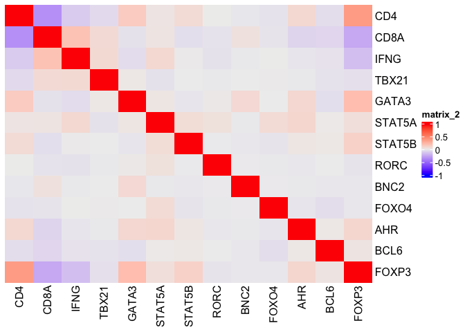<!-- -->

``` r
HNSCC_Tcells %>% ggplot() + geom_point(aes(CD4, CD8A), alpha = 0.2)
```

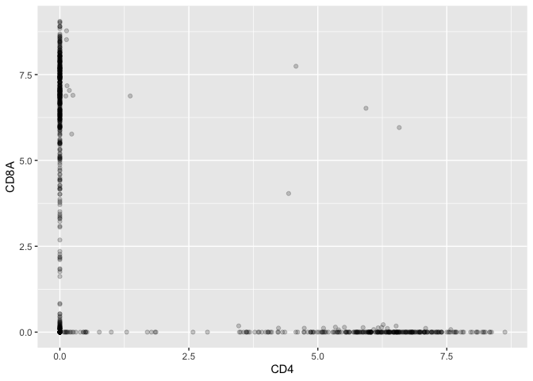<!-- -->

``` r
combined_density <- HNSCC_Tcells %>% ggplot() + geom_density(aes(CD4), fill = "green", alpha = 0.2) + geom_density(aes(CD8A), fill = "blue", alpha = 0.2)
cd4_density <- HNSCC_Tcells %>% filter(CD8A == 0) %>% ggplot() + geom_density(aes(CD4), fill = "green", alpha = 0.2)
cd8_density <- HNSCC_Tcells %>% filter(CD4 == 0) %>% ggplot() + geom_density(aes(CD8A), fill = "blue", alpha = 0.2)
cd4_density + cd8_density + combined_density
```

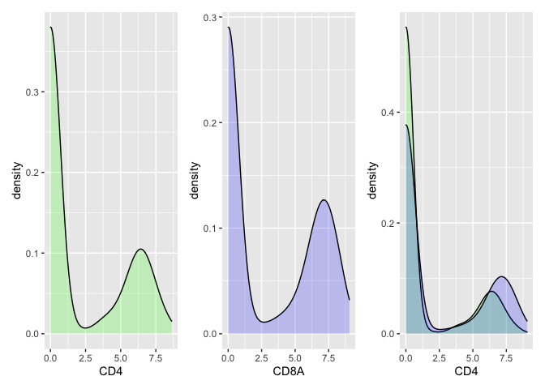<!-- -->

``` r
# Convert to a Seurat object
HNSCC.Seurat <- CreateSeuratObject(counts = t(HNSCC[,-c(1:5)]), project = "HNSCC", min.cells = 3, min.features = 50)
```

    ## Warning: The following arguments are not used: row.names

    ## Warning: Feature names cannot have underscores ('_'), replacing with dashes
    ## ('-')

``` r
HNSCC.Seurat[["Sample"]] <- rownames(HNSCC)
HNSCC.Seurat[["Dataset"]] <- "HNSCC"
HNSCC.Seurat[["Tumour.Status"]] <- HNSCC %>% select(`classified  as cancer cell`)
HNSCC.Seurat[["Cell.Type"]] <- HNSCC %>% select(`non-cancer cell type`)

HNSCC.Seurat <- FindVariableFeatures(HNSCC.Seurat)
HNSCC.Seurat <- ScaleData(HNSCC.Seurat)
```

    ## Centering and scaling data matrix

``` r
HNSCC.Seurat <- RunPCA(HNSCC.Seurat)
```

    ## PC_ 1 
    ## Positive:  PTPRC, RGS1, SRGN, LCP1, IL2RG, LAPTM5, CXCR4, ARHGDIB, CD2, CD53 
    ##     CORO1A, SAMSN1, CD3E, CD3D, CD52, LCK, CYTIP, SLA, DUSP4, SEPT1 
    ##     HCLS1, GPR183, CD96, SELPLG, CD69, ALOX5AP, PTPRCAP, FYN, CD27, ITGB2 
    ## Negative:  IFITM3, C1R, C1S, SERPING1, IGFBP7, CYR61, SPARC, BGN, NNMT, LGALS3BP 
    ##     COL1A2, COL1A1, DCN, PRKCDBP, SPARCL1, COL3A1, PCOLCE, CTGF, CD9, SERPINF1 
    ##     ISLR, MGP, TPM2, FN1, MXRA8, CRIP2, A2M, CXCL12, MFAP4, RARRES2 
    ## PC_ 2 
    ## Positive:  KRT17, KRT5, KRT6A, TACSTD2, KRT14, S100A2, KRT8, IFI27, EPCAM, ALDH3A1 
    ##     KRT6B, KRT19, ANXA8L1, CLDN4, GPX2, AKR1B10, AKR1C2, ADH7, KRT16, GSTP1 
    ##     KLK5, GJB2, FABP5, AKR1C1, UGT1A6, KRT15, COL17A1, FGFBP2, GSTA1, OSGIN1 
    ## Negative:  VIM, IFITM2, A2M, S100A4, COL1A2, PMP22, COL3A1, MGP, PCOLCE, SPARC 
    ##     ISLR, DCN, MXRA8, MFAP4, FN1, COL6A3, SPARCL1, RARRES2, CXCL12, CTGF 
    ##     CTSK, GGT5, ENG, SERPINF1, OLFML3, NNMT, BGN, PODN, SFRP2, CD248 
    ## PC_ 3 
    ## Positive:  CD2, CD3E, CD3D, LCK, CD96, FYN, GZMA, SEPT1, DUSP4, TIGIT 
    ##     CD27, ICOS, CD8A, GZMB, PRF1, SIRPG, PTPRCAP, SPOCK2, IL32, ITK 
    ##     KLRK1, SH2D1A, CXCR6, CTLA4, STAT4, CD6, NKG7, ZAP70, SLA2, CD247 
    ## Negative:  AIF1, C1QB, FCGR3A, MS4A6A, C1QA, IGSF6, C1QC, CSF1R, TYROBP, MS4A4A 
    ##     CYBB, FCER1G, FCGR2A, CD163, MRC1, PILRA, MSR1, SERPINA1, MNDA, VSIG4 
    ##     OLR1, LILRB4, RNASE6, FPR3, SLCO2B1, CD14, LST1, CPVL, HCK, HLA-DQA1 
    ## PC_ 4 
    ## Positive:  LUM, SERPINF1, LGALS3BP, DCN, AIF1, CSF1R, FCGR3A, COL6A3, C1QA, SFRP2 
    ##     IGSF6, OLFML3, C1QC, C3, PDGFRA, C1QB, COL1A2, MS4A6A, COL1A1, C1S 
    ##     CD163, MS4A4A, PILRA, DPT, MXRA8, FCGR2A, TMEM176B, CFD, COL3A1, MNDA 
    ## Negative:  PLVAP, VWF, CDH5, RAMP3, ELTD1, ECSCR, CLEC14A, EMCN, DARC, ADCY4 
    ##     MYCT1, ROBO4, TEK, AQP1, CD93, HYAL2, TIE1, NOSTRIN, SELE, RAMP2 
    ##     CCL14, SELP, S1PR1, TM4SF18, GPR116, RNASE1, TMEM255B, APLNR, CLDN5, ESAM 
    ## PC_ 5 
    ## Positive:  MUSTN1, PLN, ACTA2, FHL5, CASQ2, MYH11, TAGLN, AOC3, CNN1, PTP4A3 
    ##     ACTG2, FRZB, KCNMB1, GJA4, TPM2, RERGL, SUSD5, RGS5, ADAMTS1, RASL12 
    ##     COX4I2, KCNA5, A2M, EFHD1, SUSD2, SGCA, ITIH3, SEPT4, DES, MOCS1 
    ## Negative:  MMP2, PDGFRA, SFRP2, DPT, APOD, COL6A3, FBLN2, C3, LUM, FBLN5 
    ##     CTSK, ABCA8, SPON1, CFD, OMD, PODN, FAP, PDGFRL, CILP, OLFML3 
    ##     MEG3, COL8A1, CHRDL1, DIO2, ADH1B, ABI3BP, VIT, SFRP4, PLA2G2A, THBS4

``` r
pca_plot <- DimPlot(HNSCC.Seurat, group.by = c("Tumour.Status", "Cell.Type"), reduction = "pca") 
pca_plot[[1]]$layers[[1]]$aes_params$alpha <- 0.2
pca_plot[[2]]$layers[[1]]$aes_params$alpha <- 0.2
pca_plot 
```

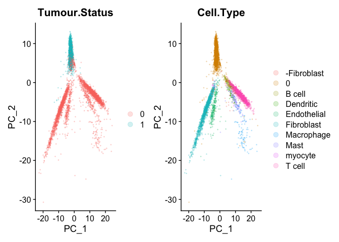<!-- -->

### T cells

``` r
Idents(HNSCC.Seurat) <- "Cell.Type"
HNSCC.Tcells <- subset(HNSCC.Seurat, idents = "T cell")
HNSCC.Tcells <- FindVariableFeatures(HNSCC.Tcells)
HNSCC.Tcells <- ScaleData(HNSCC.Tcells)
```

    ## Centering and scaling data matrix

``` r
HNSCC.Tcells <- RunPCA(HNSCC.Tcells)
```

    ## PC_ 1 
    ## Positive:  ZWINT, TYMS, TOP2A, TK1, CDK1, UBE2C, CCNB2, CDCA3, CENPW, CDKN3 
    ##     CDC20, CKS1B, CDCA5, AURKB, PLK1, MCM2, CCNB1, NDC80, FEN1, TMEM106C 
    ##     GINS2, UBE2T, CENPM, RNASEH2A, KNSTRN, WDR34, PHGDH, CDC45, APOBEC3B, NUDT1 
    ## Negative:  GZMK, CCR7, ANXA1, FOS, DKK3, ARL4D, GPR183, ANKRD37, CD69, ADRB2 
    ##     GFPT2, DHRS3, PLEK, ZNF296, NKX3-1, PLK2, DANCR, EPHA1, SNAI1, MATK 
    ##     DUSP2, LGR6, BBS2, PTGER2, AVPI1, LDLRAP1, HSBP1L1, BNIP3, ADRA2B, SCARNA17 
    ## PC_ 2 
    ## Positive:  GZMA, GZMB, CCL4, GNLY, GZMH, RGS1, CXCL13, CXCR6, S100A4, IFNG 
    ##     ANXA1, KIR2DL4, CCL3, VCAM1, KLRC1, ZNF683, GZMK, ALOX5AP, KRT86, GZMM 
    ##     IL18RAP, SLC27A2, CD200R1, FASLG, LOC643733, GFPT2, KLRB1, PLEKHF1, RNF113A, REG4 
    ## Negative:  MS4A1, BANK1, BLNK, IRF8, FCRLA, NAPSB, CD19, HLA-DOB, IGLL5, ADAM28 
    ##     FAM49A, CD79A, BLK, CD22, IGJ, PKIG, TCL1A, LY86, HLA-DRA, KIAA0226L 
    ##     ELL3, KYNU, FCRL2, HLA-DMB, PDLIM1, CXCR5, CTSH, CR2, CD40, FAM26F 
    ## PC_ 3 
    ## Positive:  CCR8, IL1R2, LAIR2, CD177, EPHX2, NGFRAP1, S100A4, EBI3, PTGIR, CD79B 
    ##     IL1RN, CX3CR1, NINJ1, CHRNA6, LTA, PRKCDBP, CXCR6, IL17RB, HIST1H2AC, ADPRH 
    ##     CCR4, VWA5A, UNC119, IL4I1, SPINT1, UTS2, GPR183, PHLDA2, AHSP, SUOX 
    ## Negative:  GZMA, CCL4, GZMB, TOP2A, GZMH, CCL3, CDK1, ANXA1, UBE2C, IFNG 
    ##     KIR2DL4, TYMS, HOPX, HLA-DRA, CXCL13, ZWINT, ALOX5AP, TK1, CD69, CDKN3 
    ##     CDC20, CDCA5, GNLY, KLRC1, PLK1, CDCA3, CCNB2, ZNF683, CKS1B, CCNB1 
    ## PC_ 4 
    ## Positive:  GZMB, GNLY, CXCL13, GZMA, KLRC1, KIR2DL4, KRT86, CCL3, GZMH, HOPX 
    ##     RGS1, ALOX5AP, VCAM1, ZNF683, CCL4, KRT81, CXCR6, HLA-DRA, TYROBP, KIR2DS4 
    ##     IL18RAP, LAT2, RGS2, ECI2, FCER1G, PLS3, KIR2DL3, CCR1, KIR3DL2, GFOD1 
    ## Negative:  UBE2C, CCNB2, CCNB1, PLK1, CDC20, TOP2A, CCR7, CDCA3, CENPW, AURKB 
    ##     KNSTRN, CDKN3, CDK1, CDCA5, CKS1B, FOS, PSRC1, NDC80, APOBEC3B, TTK 
    ##     ZWINT, GPR183, MAD2L1, DHRS3, UBAC1, CD40LG, RPL39L, UBE2T, CCDC101, PINX1 
    ## PC_ 5 
    ## Positive:  TYROBP, FCER1G, CST3, FOS, GZMK, CD300A, DERL3, KLRF1, SERPINF1, CFP 
    ##     AREG, SUSD1, NCR2, PTCRA, LILRA4, DKK3, ZDHHC24, DUSP2, ID1, PLD4 
    ##     NME4, GIMAP8, EPHA1, FGR, MYC, WDR77, MRPS15, CCR7, P2RY14, IGJ 
    ## Negative:  CXCL13, BANK1, CXCR6, BLNK, CD19, FCRLA, ADAM28, ELL3, MS4A1, CD22 
    ##     CD72, HLA-DRA, CD86, IGLL5, HLA-DOB, HDAC9, PLS3, GEMIN4, S100A4, RGS1 
    ##     ST6GALNAC3, ALOX5AP, BHLHE40-AS1, CAMK1, WDR3, CCL20, PPFIBP2, REG4, QPCT, CD79A

``` r
FeaturePlot(HNSCC.Tcells, features = markers, reduction = 'pca')
```

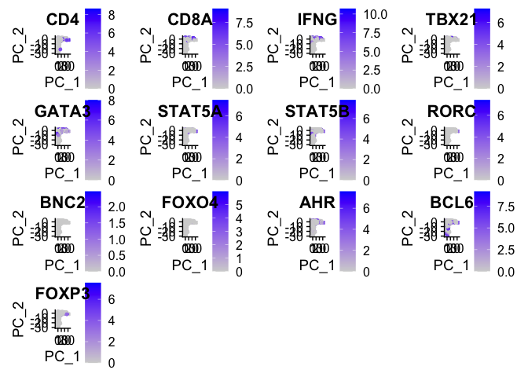<!-- -->

``` r
FeaturePlot(HNSCC.Tcells, features = c("CD4", "CD8A"), reduction = 'pca')
```

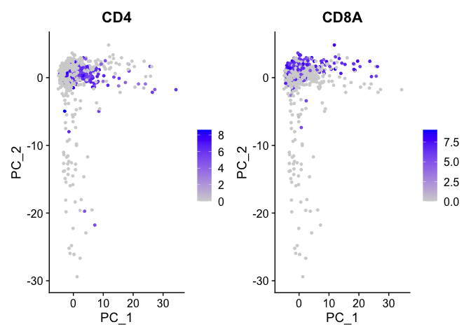<!-- -->

### CD4+ T cells

``` r
HNSCC.cd4 <- subset(HNSCC.Tcells, subset = CD4 > 0)
HNSCC.cd4 <- FindVariableFeatures(HNSCC.cd4)
HNSCC.cd4 <- ScaleData(HNSCC.cd4)
```

    ## Centering and scaling data matrix

``` r
HNSCC.cd4 <- RunPCA(HNSCC.cd4)
```

    ## PC_ 1 
    ## Positive:  JUNB, GZMK, AOAH, CD8A, NKG7, CXCR4, GZMH, KANSL1-AS1, LY96, DKK3 
    ##     TXK, MATK, PLK2, MBOAT4, GPR183, RNF146, ZNF18, ADHFE1, GPR18, VNN2 
    ##     ZFAND1, CPNE7, TCEAL3, ITGB7, WDR75, ANKRD37, PTGER2, L3HYPDH, ZNF83, LINC00324 
    ## Negative:  UBE2C, CDK1, ZWINT, CDCA8, BIRC5, CCNB2, DLGAP5, TOP2A, TYMS, CENPW 
    ##     CCNB1, ASF1B, AURKB, NUF2, CDKN3, CDC20, CDCA3, KIF2C, TROAP, BUB1 
    ##     SPAG5, CKS1B, KIF4A, KNSTRN, PLK1, WDR34, KIFC1, FAM64A, MCM2, TK1 
    ## PC_ 2 
    ## Positive:  IFITM1, GAPDH, TNFRSF18, S100A4, CXCR6, DUSP2, CCNB1, C3AR1, DUSP1, CDC20 
    ##     RNF26, KLHL12, EMC6, TMEM216, NDC80, DPAGT1, LYRM1, MAPKAPK5, PLK1, ECI2 
    ##     RUFY1, CSRP2BP, KNSTRN, WDR85, AGTRAP, IL1RN, HCP5, EIF2B2, MTX2, BIRC5 
    ## Negative:  CYBB, BCL11A, TCL1A, IGJ, IL3RA, DERL3, MYBL2, SERPINF1, LILRA4, MPEG1 
    ##     PLVAP, THBD, EPHA2, NRP1, PLD4, NAPSB, PTCRA, MS4A6A, CST3, TYROBP 
    ##     VASH2, PFKFB2, SUSD1, IRF8, CLIC3, BLK, TSPAN13, PLA2G16, SPINT2, IGSF6 
    ## PC_ 3 
    ## Positive:  ANXA1, TROAP, DEPDC1, CXCR4, DLGAP5, CDC25C, UBE2C, KIF4A, CCL4, GZMA 
    ##     CDCA2, KIF20A, CCR7, KIF2C, GZMK, APOBEC3B, PSRC1, TRAIP, CDC20, CDKN3 
    ##     NUF2, CCNB1, TOP2A, PLK1, KIFC1, FAM64A, EPHA1, CDCA8, LOC100132891, DHRS3 
    ## Negative:  TNFRSF18, GINS2, S100A4, SAT1, UCP2, LTB, KLHL11, MCM2, PTRH1, CXCR6 
    ##     UTS2, MRPL48, ZW10, MPV17L2, MFSD5, GAPDH, LMAN2L, PANX1, IL1RN, WBP5 
    ##     ZNF32, SFT2D2, ECEL1, C1orf123, AAAS, NPPC, NME1-NME2, TRMT2A, ZNF35, GALE 
    ## PC_ 4 
    ## Positive:  PLK1, TROAP, FAM64A, DEPDC1, LTB, KIF4A, NRM, CXCR6, UCP2, REEP4 
    ##     S100A4, CDCA7L, KIF20A, RPL39L, CDC25C, KRT6A, CDC20, KNSTRN, TOP2A, IL1RN 
    ##     SAT1, APOBEC3B, TNFRSF18, AAAS, DGCR5, DLGAP5, LXN, YAE1D1, NOA1, PPIH 
    ## Negative:  MCM2, KLHL26, NKG7, TK1, OIP5, POP1, RFC4, TYMS, PHGDH, GINS2 
    ##     GZMH, CCL4, AOAH, ASF1B, PAK3, GZMK, DMD, CD8A, RMI2, KIR3DL1 
    ##     PARP2, RASGEF1B, CXCR4, KIR2DL4, FBXO5, KIR2DL3, GFPT2, F8, TESK2, MPV17L2 
    ## PC_ 5 
    ## Positive:  KIR2DL4, KIR3DL1, KIR2DL3, DGAT2, KLRC3, KIR3DL2, METTL1, ABCG2, WDR41, PAK3 
    ##     GALNT4, GZMH, RCAN2, ZNF225, FAM207A, GFPT2, PEMT, GZMB, TESK2, NKG7 
    ##     GNLY, HOPX, PLCG2, CCR1, UNQ6494, RAB24, ZNF684, ZNF350, TAMM41, IDUA 
    ## Negative:  CCR7, MPV17L2, OIP5, HAUS4, LINC00467, F8, C11orf1, TRIM34, RFC4, GINS2 
    ##     GEMIN2, NEK6, PHGDH, ZNF133, MRM1, RORC, ZNF776, TK1, FAM162A, TNFSF8 
    ##     PAXIP1, PRIM1, CD40LG, RMI2, TTC9C, CHI3L2, PARP2, GTSF1, ZC3HC1, GPN2

``` r
FeaturePlot(HNSCC.cd4, features = markers, reduction = 'pca')
```

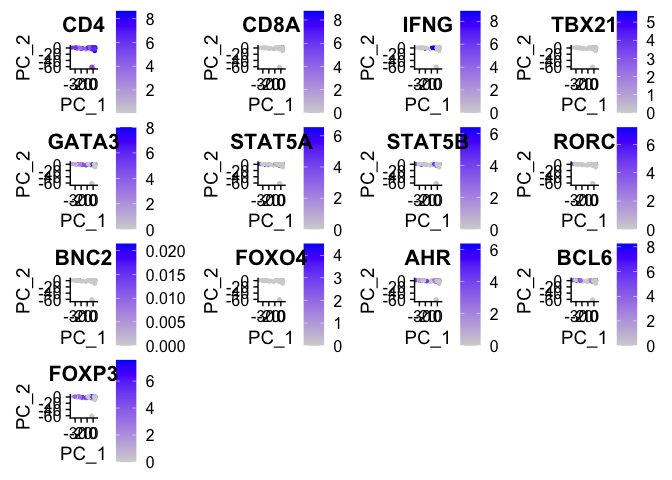<!-- -->

``` r
FeaturePlot(HNSCC.cd4, dims = c(1,3), features = markers, reduction = 'pca')
```

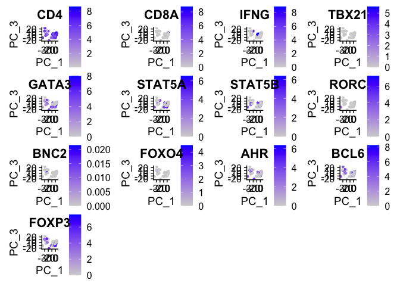<!-- -->

``` r
FeaturePlot(HNSCC.cd4, dims = c(3,4), features = markers, reduction = 'pca')
```

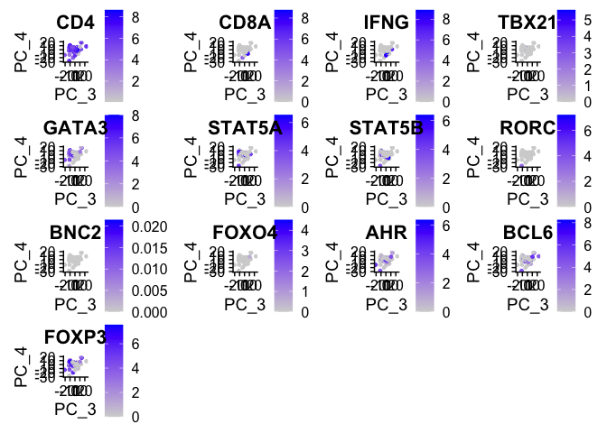<!-- -->

# Look at the two datasets together

``` r
combined.Seurat <- merge(melanoma.cd4, HNSCC.cd4)

combined.Seurat <- FindVariableFeatures(combined.Seurat)
combined.Seurat <- ScaleData(combined.Seurat)
```

    ## Centering and scaling data matrix

``` r
combined.Seurat <- RunPCA(combined.Seurat)
```

    ## PC_ 1 
    ## Positive:  TYMS, ZWINT, UBE2C, CCNB2, TPI1, ASF1B, CDK1, TK1, PGAM1, CDKN3 
    ##     CDC20, NME1, PRDX3, ANXA5, APOBEC3C, COX5A, HLA-DPA1, PTTG1, HLA-DRB1, PSMA6 
    ##     FABP5, SLC43A3, WARS, HLA-DRA, CHMP2A, GINS2, PSMB3, BST2, HLA-DMA, UBE2T 
    ## Negative:  TXNIP, CCR7, CD69, ANXA1, FOS, RPS12, ZBTB16, MBOAT4, RPL30, TMEM71 
    ##     GPR183, CD40LG, GIMAP7, RPLP2, SLC40A1, SNORA62, RPS13, PTGER2, OR1N2, GADD45G 
    ##     LY9, RPL26, FAM19A1, RPS15A, CYSLTR1, DUSP1, RPL13A, SNORD32A, TSSK3, RPL21 
    ## PC_ 2 
    ## Positive:  RPS12, RPLP2, RPL30, RPL26, RPS28, RPS15A, RPL12, RPS8, RPSA, RPS5 
    ##     RPL29, RPS13, RPL7A, RPL13A, EEF1B2, CD48, TXNIP, GAS5, GIMAP7, GIMAP5 
    ##     RARRES3, EIF3F, CD69, GIMAP2, EIF3K, HIST1H4C, CD40LG, CCR7, RPL21P28, NME2 
    ## Negative:  TNFRSF18, HERPUD1, SAMSN1, IL1R2, CCR8, LMNA, TNFRSF4, CXCR6, IL2RA, BATF 
    ##     PMAIP1, SEP15, ICOS, RGCC, ZBTB32, CD177, S100A4, CTLA4, NFKBIA, RGS1 
    ##     GEM, CDKN1A, TYMP, CARD16, SAT1, LAIR2, SYNGR2, MAGEH1, HBP1, SLC3A2 
    ## PC_ 3 
    ## Positive:  LTB, IL2RA, CCR8, RPS8, MAGEH1, SELL, TNFRSF4, RPL29, RPL26, CCDC167 
    ##     RPSA, AQP3, RPS28, RPS15A, GLRX, GINS2, RPS12, RPL7A, RPS5, CXCR5 
    ##     EEF1B2, CARD16, RPS13, DNPH1, RPL13A, BATF, UCP2, RPL30, HAX1, IL1R2 
    ## Negative:  NKG7, CCL4, CCL4L2, CCL4L1, KLRK1, CD8A, CCL3, GZMB, GZMA, GZMH 
    ##     CD8B, CCL3L3, FCER1G, TYROBP, CTSW, KLRC3, FCGR3A, IFNG, ADM, IL8 
    ##     CLIC3, CCL2, GZMK, CD14, IFI30, HOPX, HSPA6, TARP, BHLHE40, S100A8 
    ## PC_ 4 
    ## Positive:  CDK1, TYMS, ZWINT, ASF1B, UBE2C, CCNB2, CDC20, CCNB1, TK1, UBE2T 
    ##     CDKN3, PLK1, CENPM, CKS1B, KNSTRN, GMNN, CKS2, KIF22, TEX30, GINS2 
    ##     SNRNP25, TUBA1B, TUBB4B, PCNA, ANXA1, EIF4A3, RPL39L, GZMA, KPNA2, H2AFZ 
    ## Negative:  LAIR2, TYROBP, LTB, IL2RA, IL1R2, CCR8, FCER1G, CD177, CARD16, TNFRSF4 
    ##     ACP5, IL1RN, MAGEH1, C1QA, CST3, UBD, C1QB, CISH, SAT1, TNFRSF18 
    ##     TYMP, C3AR1, CCR1, CD27, CRADD, CXCR6, ADM, BATF, LGALS3, CXCL2 
    ## PC_ 5 
    ## Positive:  TYROBP, FOS, CST3, ADM, CCR7, UBD, TIMP1, FCER1G, CDKN1A, TMEM176A 
    ##     ANXA1, C1orf162, NFKBIA, CXCL2, SOD2, LTB, GADD45B, S100A9, LMNA, CLEC4G 
    ##     CHI3L1, GPR183, IL33, SELL, IFI30, FCGRT, RAB20, RARRES2, CD83, SDPR 
    ## Negative:  PDCD1, CCL4, CCL4L1, CCL4L2, CCR5, CHI3L2, CST7, NKG7, GZMA, APOBEC3G 
    ##     CXCL13, GZMK, IFNG, CD200, PRF1, IL21, SIRPG, NINJ2, APOBEC3C, TPST2 
    ##     LOC100128420, CTLA4, CHST12, CXCR5, CD8A, ADORA2A, GZMH, OASL, FASLG, APOBEC3H

``` r
pca_plot <- DimPlot(combined.Seurat, group.by = "Dataset", reduction = "pca") 
pca_plot[[1]]$layers[[1]]$aes_params$alpha <- 0.2
pca_plot 
```

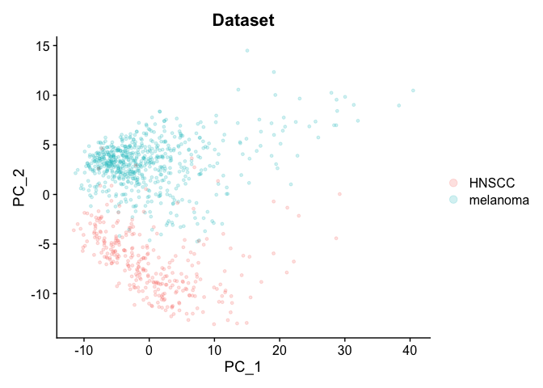<!-- -->

``` r
DimPlot(combined.Seurat, dims = c(1,5), group.by = "Dataset", reduction = "pca")
```

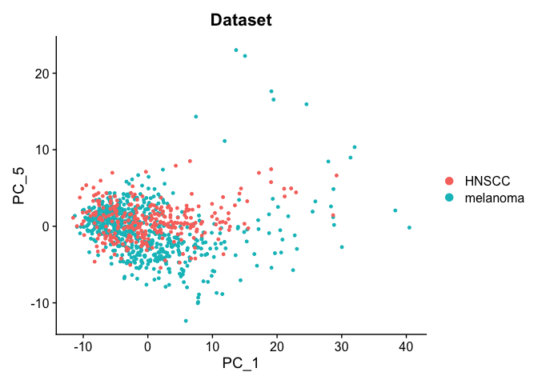<!-- -->

``` r
FeaturePlot(combined.Seurat, features = markers, reduction = 'pca', dims = c(1,5))
```

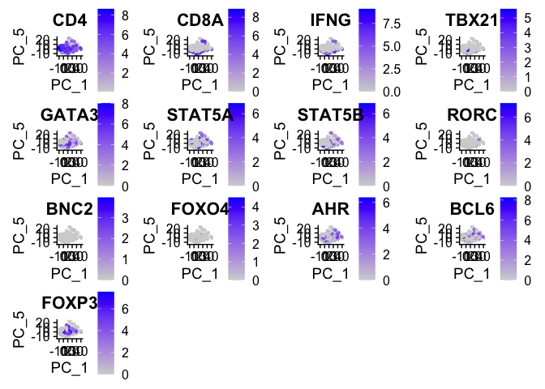<!-- -->

# [GSE147928](https://www.ncbi.nlm.nih.gov/geo/query/acc.cgi?acc=GSE147928) (not working)

## Characterisation of CD4+ T-cell subtypes using single cell RNA sequencing and the impact of cell number and sequencing depth

Found in this paper [Characterisation of CD4+ T-cell subtypes using
single cell RNA sequencing and the impact of cell number and sequencing
depth](https://www.nature.com/articles/s41598-020-76972-9?elqTrackId=1b0686d8aecb43c997511015fc34c3b7)

PBMCs extracted from a healthy human volunteer. CD4+ T-cells were
isolated then either stimulated with anti-CD3/CD28 or left unstimulated.

``` r
# This doesn't work for whatever reason.
# stimulated <- readRDS("healthy_pbmcs/GSM4450386_stimulated_full_seurat.rds.gz")
# unstimulated <- readRDS("healthy_pbmcs/GSM4450387_unstimulated_full_seurat.rds.gz")
```
